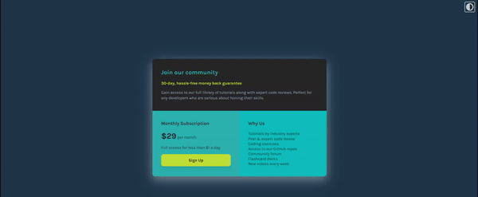

# Frontend Mentor - Single price grid component solution

This is a solution to the [Single price grid component challenge on Frontend Mentor](https://www.frontendmentor.io/challenges/single-price-grid-component-5ce41129d0ff452fec5abbbc). Frontend Mentor challenges help you improve your coding skills by building realistic projects. 

## Table of contents

- [Overview](#overview)
  - [The challenge](#the-challenge)
- [My process](#my-process)
  - [Built with](#built-with)
- [Author](#author)

**Note: Delete this note and update the table of contents based on what sections you keep.**

## Overview

### The challenge

Users should be able to:

- View the optimal layout for the component depending on their device's screen size
- See a hover state on desktop for the Sign Up call-to-action
- Toggle between Light and Dark Mode using Javascript

### Links

- Solution URL: (https://www.frontendmentor.io/challenges/single-price-grid-component-5ce41129d0ff452fec5abbbc/hub/single-price-grid-component-flexbox-grid-sass-dark-mode-js-FAdB6fbDxB)
- Live Site URL: (https://lysitheadarkknight.github.io/SingleGridComponent/

## My process

### Built with

- Semantic HTML5 markup
- SASS - Sass modules
- Flexbox
- Grid
- Dark Mode Javascript

### Useful resources

- (https://youtu.be/0xMQfnTU6oo) Traversy Media's CSS Grid Crash Course 2022
- (https://codepen.io/sdthornton/pen/wBZdXq) Material Design Box Shadows
- (https://youtu.be/wodWDIdV9BY) Kevin Powell's How to make a website light/dark toggle with CSS & JS

## Author

- Frontend Mentor - [@LysitheaDarkKnight](https://www.frontendmentor.io/profile/@LysitheaDarkKnight)
